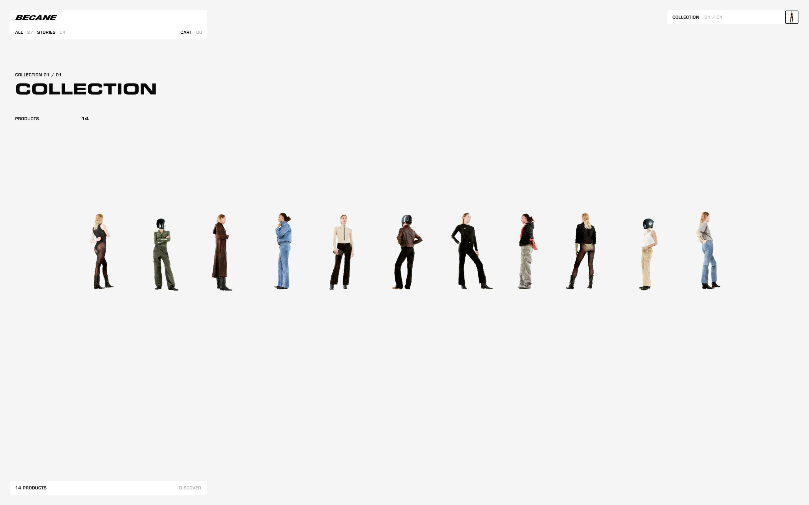
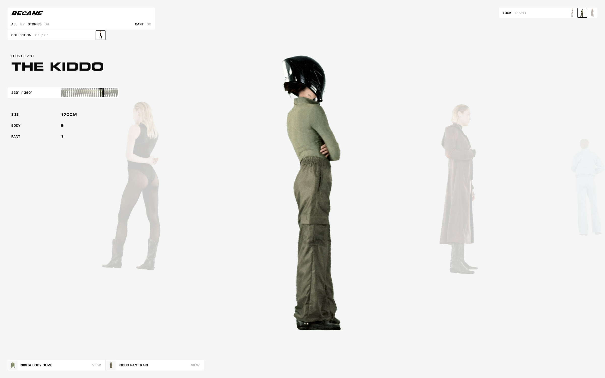
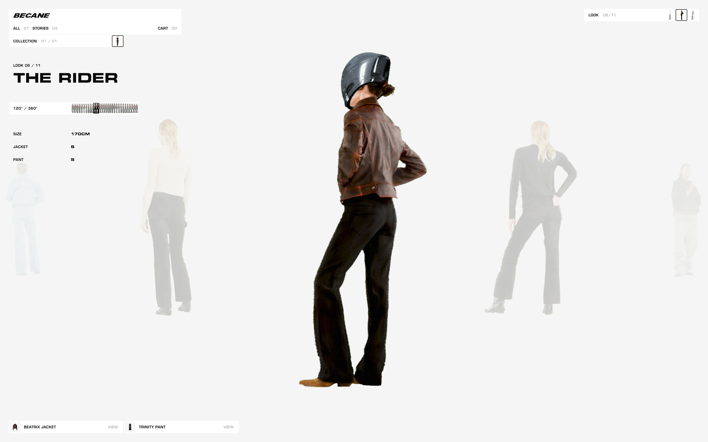
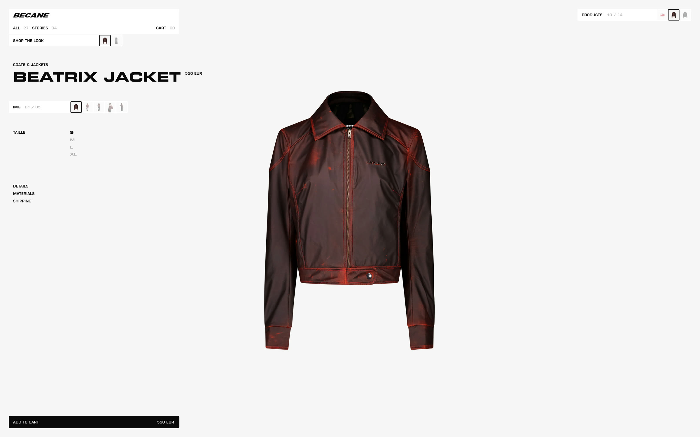
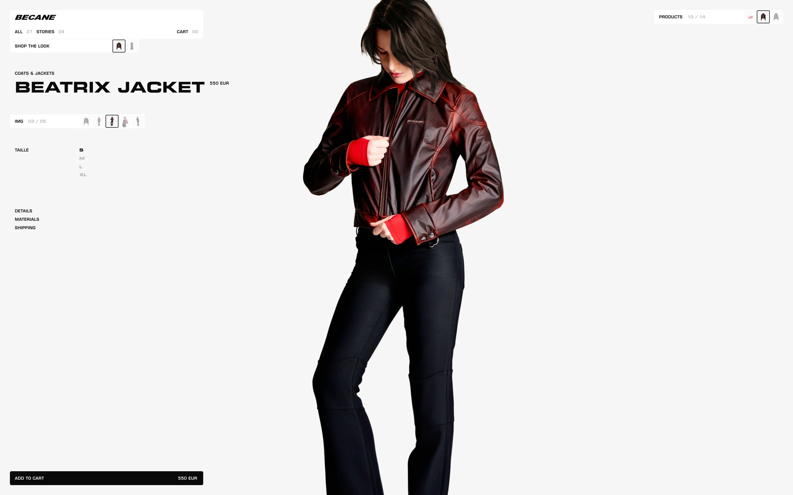
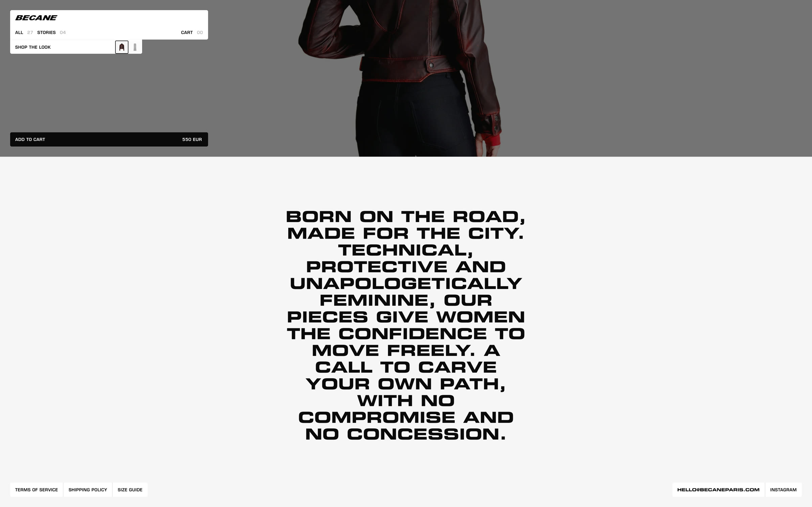
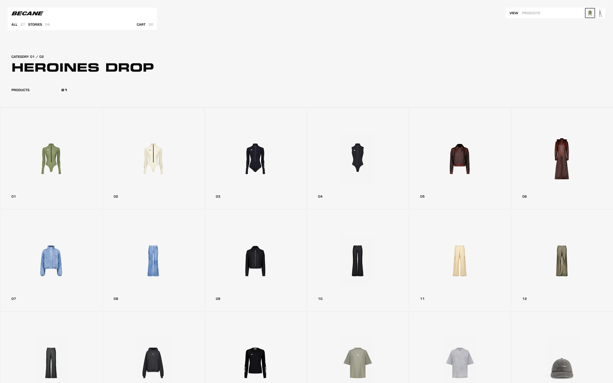
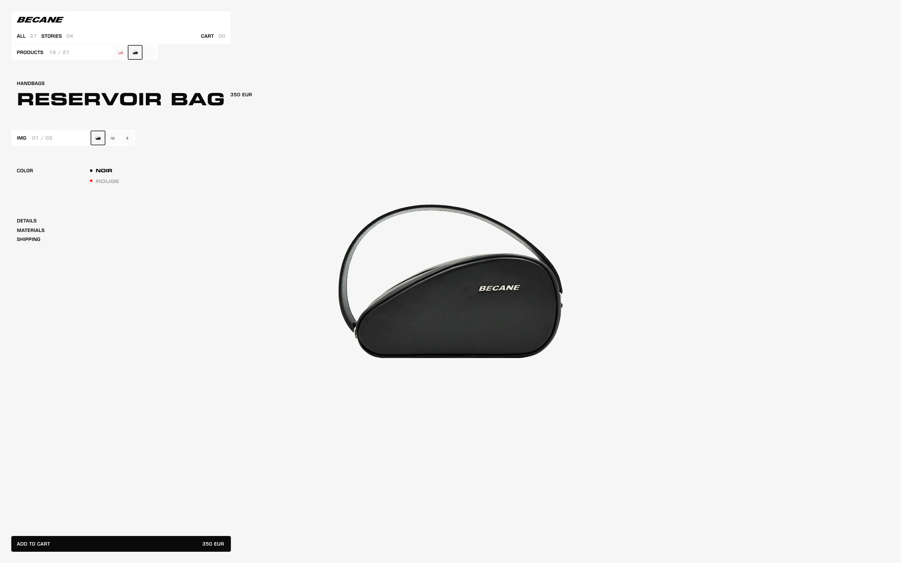
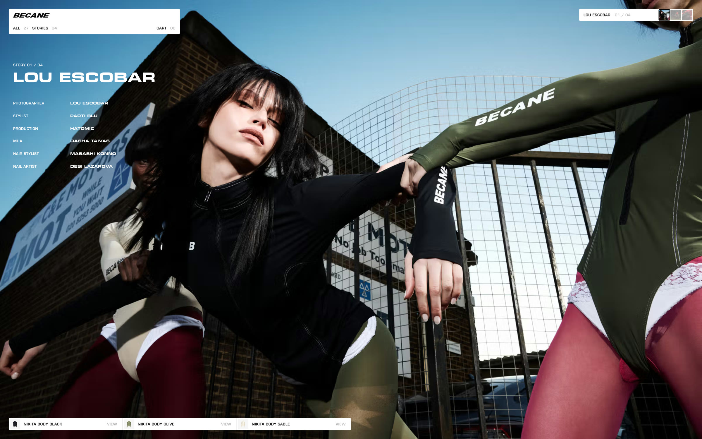

# Bécane — nine screen forms a guided-shopping surface can take

**Date:** 2026-08-31 · **By:** Yihan · **Source:** https://becaneparis.com/

法国女性摩托机能品牌 THE RIDER | Bécane 的独立站。技术栈 Next.js + Three.js(3D)+ Motion(动效)+ Shopify(电商)。九张 = 九种**导购可呈现的画面形式**,直接从线上站点按 URL 截图(1600×1000 @2x)。复刻见 market-verse `prototypes/PT-006-becane复刻.html`(本地)。

## 1 · Full-array ghosting|全阵列虚影

一屏放下整个系列,11 个 look 一字排开、等距缩小,尺度本身就是目录。

https://becaneparis.com/

## 2 · Focus by fading siblings|聚焦显影

被选中的 look 满色放大,其余留在原位淡到近乎消失——"选择"用显影表达,不用跳转。

https://becaneparis.com/looks/heroines-drop/the-kiddo

## 3 · Model as navigation|人物即导航

look 有名字(THE RIDER)、编号(06/11)、360° 刻度与身体参数(SIZE/JACKET/PANT),底部挂该 look 的单品 chips;拖左侧胶片条即旋转模特。

https://becaneparis.com/looks/heroines-drop/the-rider

## 4 · Isolated product float|单品抠图悬浮

白底、无场景、居中悬空,参数全部收进左侧细字栏,商品是画面里唯一的重量。

https://becaneparis.com/products/beatrix-jacket

## 5 · Scroll swaps the evidence|滚动换证据

同一页往下滚,抠图退场、实拍上身进场——"看清楚"和"看氛围"是同一条滚动轴上的两段。

https://becaneparis.com/products/beatrix-jacket(下滚 35%)

## 6 · Manifesto interstitial|宣言插页

纯文本大字压在页尾,不带任何商品,用节奏和态度收束浏览。

https://becaneparis.com/products/beatrix-jacket(下滚到底)

## 7 · Cutout scatter grid|抠图散列网格

全品类平铺,每格只有抠图和一个编号,靠形状而非文案区分。

https://becaneparis.com/indexes/products

## 8 · Same shell, non-apparel|同壳复用到非服装

包用的是与服装完全相同的版式,证明这套画面语言不依赖"人"。

https://becaneparis.com/products/reservoir-bag-1

## 9 · Editorial story page|编辑故事页

整屏满幅大片 + 左上角摄影/造型/制片 credit 表,商品 chips 仍挂在底部——内容与货架共用一个外壳。

https://becaneparis.com/story/lou-escobar-becane-paris
