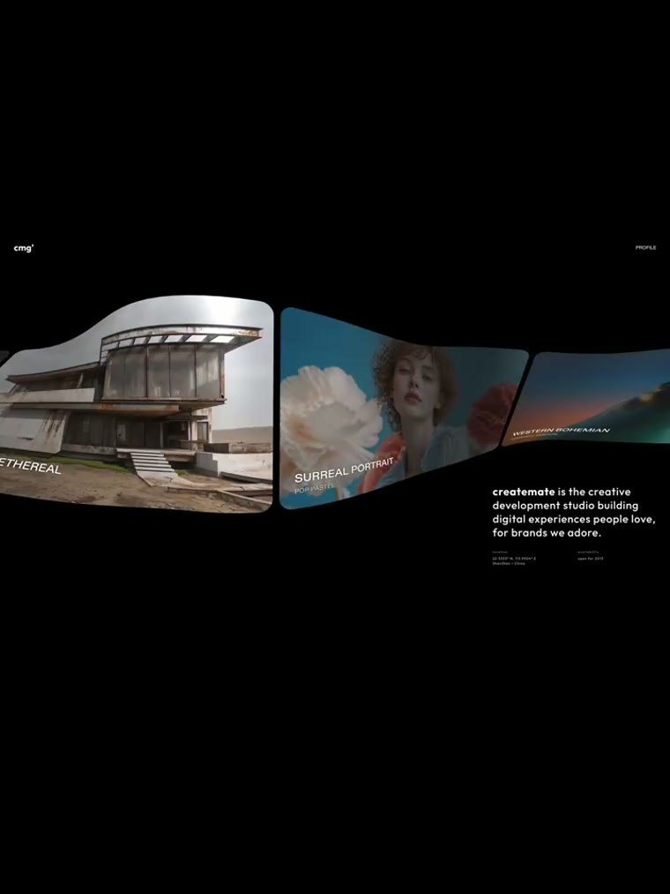
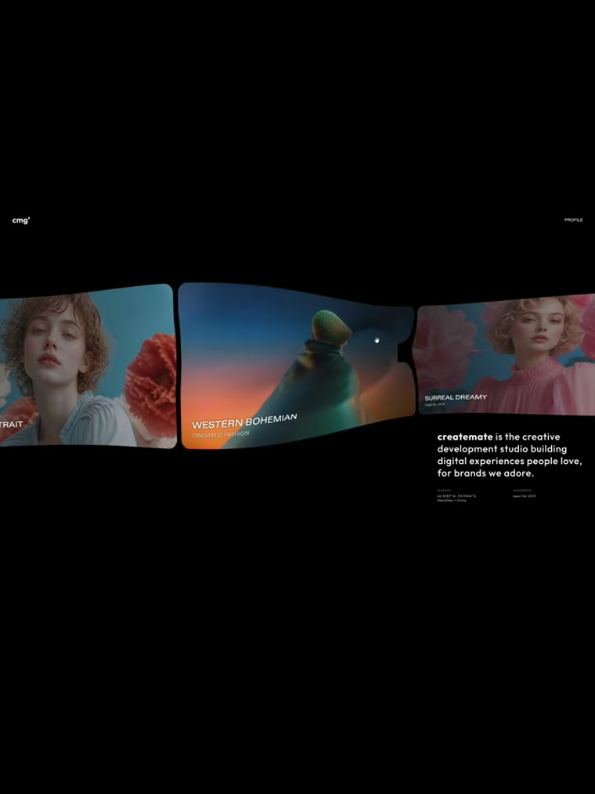
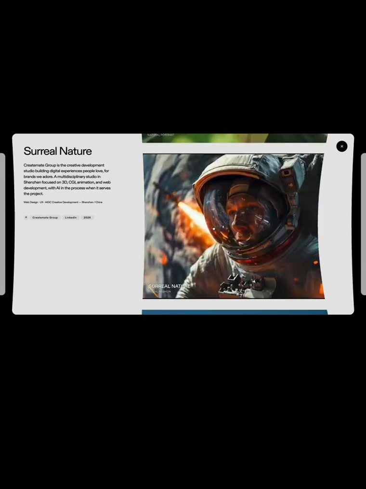
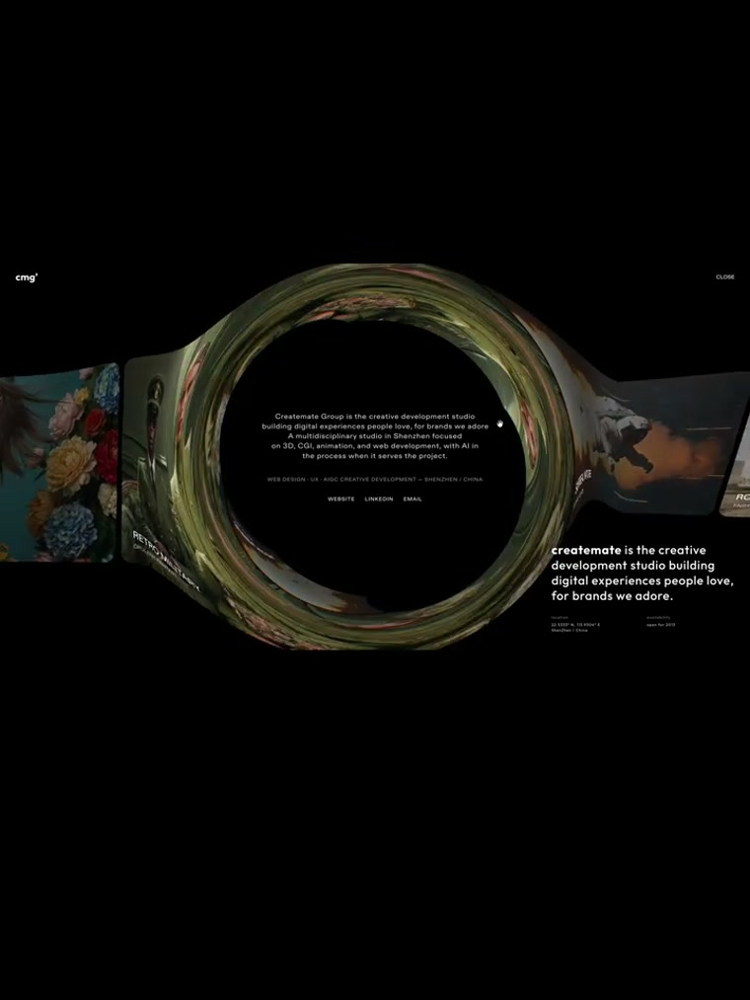

# createmate / cmg° — ribbon scroll with morph-in-place navigation

**Date:** 2026-09-01 · **By:** Yihan · **Source:** 小红书视频帖抽帧(4s 间隔),https://www.xiaohongshu.com/discovery/item/6a964b98000000001203620a(#vibecoding大赏)· 官网 URL 视频未露出,待补

深圳创意工作室 Createmate Group 的作品集站,「这个交互绝了」视频帖里的主角。换皮复刻见 market-verse `prototypes/PT-012-丝带导购.html`(本地)。

## 1 · Wave ribbon|波浪丝带

内容 = 一条横贯屏幕的卡片带,随位置起伏形变,可拖拽带惯性;黑底衬图,UI 字极少极小。

## 2 · Caps-on-image + signature block|大写压图 + 签名块

卡上英文大写标题+小字副题;右下角固定「签名文字」(bold 引子+正文+小 caps 元数据)——工作室放宣言的位置,我们复刻时给了 agent 说话用。

## 3 · Morph-in-place detail|就地形变详情

点卡片,小卡形变成米白大卡(左栏标题/正文/pill 标签,右侧大图,黑圆 ✕),不跳页。

## 4 · Ring "black hole" menu|圆环黑洞菜单

点「更多」,卡片形变成一个图片织成的圆环,信息从环心升起——loading→丝带→黑洞是一条连续的形变叙事。

原帖对交互的文字拆解(节录):loading 形变成滚动丝带 / 滚动不受图片视频影响 / 卡片可拖拽带弹簧物理 / 小卡过渡成大卡形态自然 / 按钮 hover 有凹凸立体感 / 整体画面有水波纹效果。
