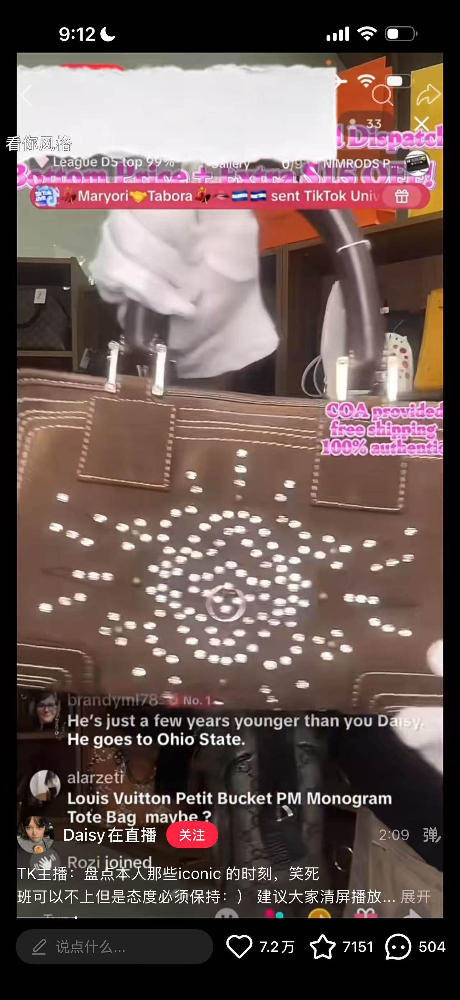
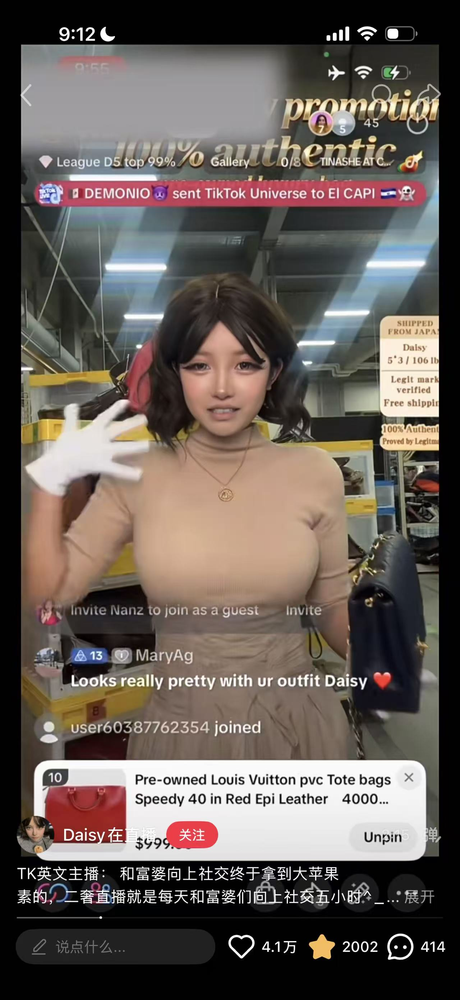
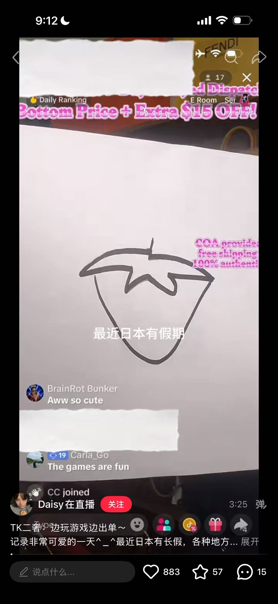

# TikTok live commerce — six-layer information overlay on one screen

**Date:** 2026-09-01 · **By:** Yihan · **Source:** 抖音博主「TK二奢 / TK英文主播」分享的自家 TikTok 直播录屏(二手,非 TikTok 原始截图)· 创始人截图

TikTok 二奢直播带货,一屏叠六层信息。**画面分层**(从底到顶):

1. **实拍视频流** —— 主播出镜 / 商品特写,竖屏满幅
2. **常驻贴片文字**(固定不动)—— 信任信息不用点开就在脸上:`100% authentic` · `pre-owned luxury bag` · `COA provided / free shipping` · `SHIPPED FROM JAPAN` · `Legit mark verified`;促销也是贴片:`Bottom Price + Extra $15 OFF`
3. **主播身材数据常驻** —— `Daisy 5'3 / 106 lbs`,给观众换算包的比例用
4. **实时弹幕流**(左下滚动)—— 混着提问("any gst with silver hardware?")、闲聊("Looks really pretty with ur outfit")、进场提示("user60387762354 joined")
5. **事件横幅**(顶部飘过)—— 送礼:`DEMONIO sent TikTok Universe to El CAPI`
6. **商品卡 pin 在底部** —— 编号 + 缩略图 + 全名 + 价格 + `Unpin`(如「10 · Pre-owned Louis Vuitton pvc Tote bags Speedy 40 in Red Epi Leather · $999」)
7. **状态/排行条** —— `Daily Ranking` · `League D5 top 99%` · `Gallery 0/9` · 在线人数

商品特写(包的细节 + 促销贴片 + 弹幕):

主播出镜 + 底部 pin 住的商品卡:

**画面里完全没有商品**——主播在纸上画草莓,原博文字「边玩游戏边出单」:

常驻信任贴片最全的一张(粉色中文字是原博主自己加的批注,非直播画面):

