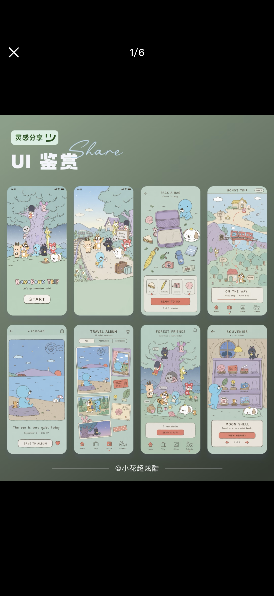
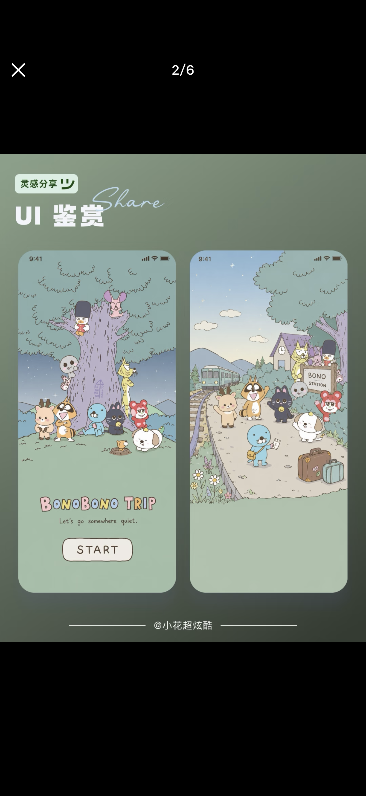
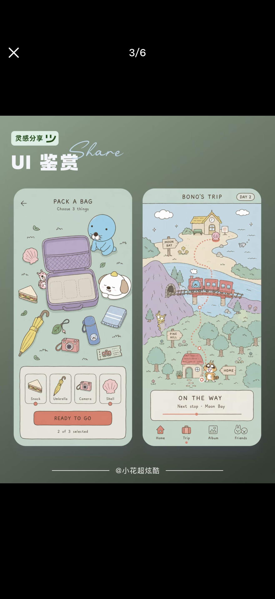
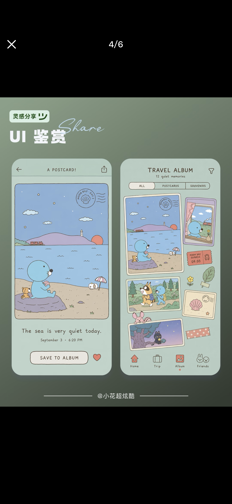
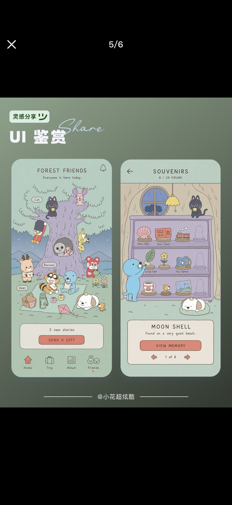

# Illustration as interface — the whole screen is one hand-drawn picture, controls included

**Date:** 2026-09-07 · **By:** Yihan · **Source:** 微信 UI 鉴赏帖 @小花超炫酷 转发(二手,原设计作者未标明)· 创始人提供

**BONOBONO TRIP**(旅行主题 app 概念稿)。画面特征:

- 通体柔和的莫兰迪绿/薄荷绿,低饱和;主按钮用砖红色,是全屏唯一的高饱和色
- **每屏一整幅插画占主体**,插画不是配图,是界面本身
- **UI 控件用同一支笔触画出来**:按钮、选择器、进度条、tab bar 图标(房子/行李箱/相册/兔子头)都是手绘的,没有标准控件
- 圆角矩形卡片 + 米白色信息条压在插画下方,承载文字与操作
- 手写感英文字体,小字号,大量留白
- 具体页面:启动页、打包行李(从物品里选 3 件)、旅程地图(虚线路径 + 进度)、明信片、旅行相册(拼贴 + 胶带 + 票根)、好友森林、纪念品柜(8/24 收集进度)

