# Douyin dress-up formats — turning commerce objects into the set, and the video into a toy

**Date:** 2026-09-08 · **By:** 创始人 · **Source:** 抖音 @原来是陶阿狗君,截图

一个博主的七种玩法。共同点:**把商业物件(色卡、小票、规格图)当成画面主体**,或者**把视频变成观众能操作的东西**。

## 1. Pantone swatch as the set — 色卡变装

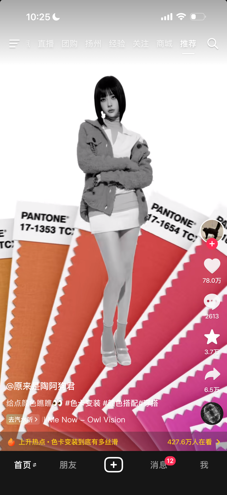
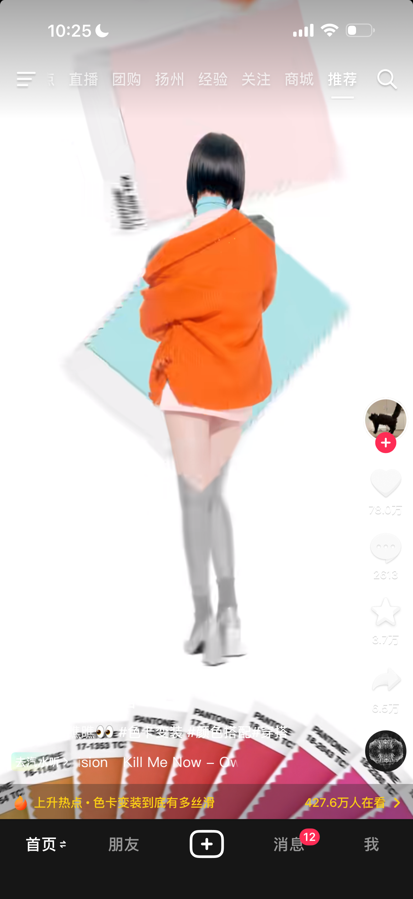
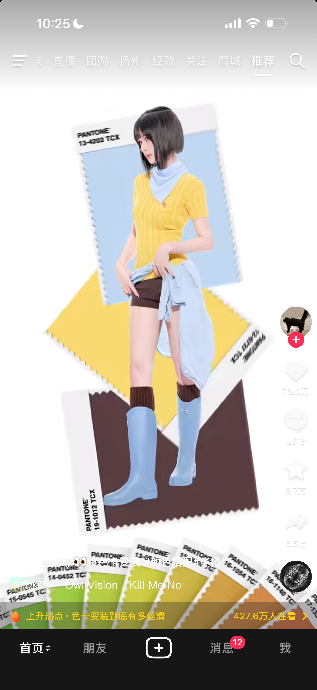
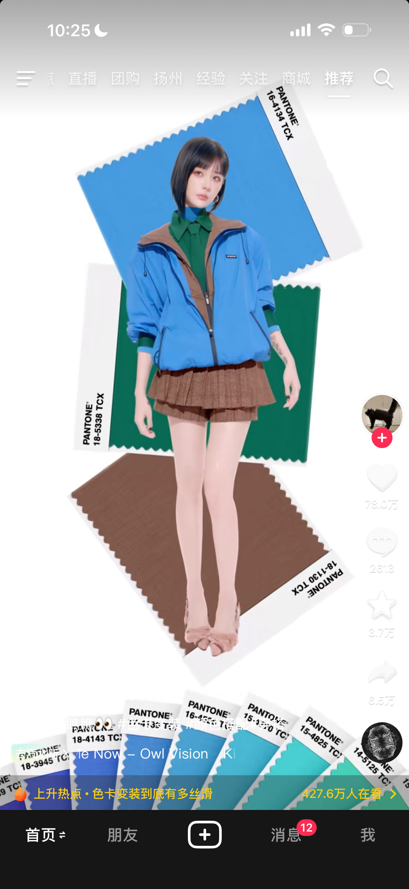

Pantone 色卡扇形铺开当背景,人物穿搭的配色**从色卡里取**,换一组色卡就换一身。首帧人物是黑白的,颜色只存在于色卡上。#色卡变装 #颜色搭配 · 78 万赞 · 427.6 万人在看

## 2. Gacha reel + screenshot to lock your outfit — 截图选取今日穿搭

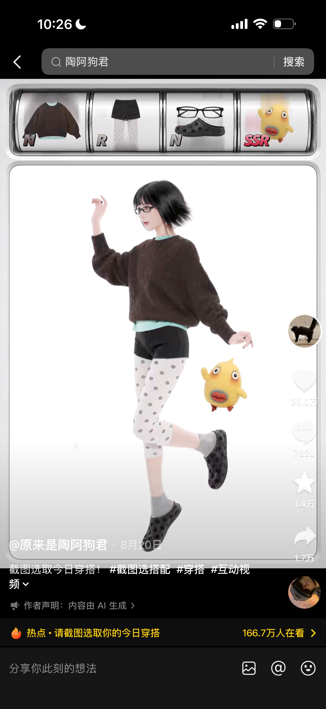

顶部一排老虎机式滚轮转着上衣/裤子/眼镜/挂件,每格标 **N / R / SSR 稀有度**;观众**在想要的一刻截图**,截到什么就是今天的穿搭。#截图选搭配 #互动视频 · 作者声明内容由 AI 生成 · 33 万赞 · 166.7 万人在看

## 3. Brand receipt as the backdrop — 拟人变装

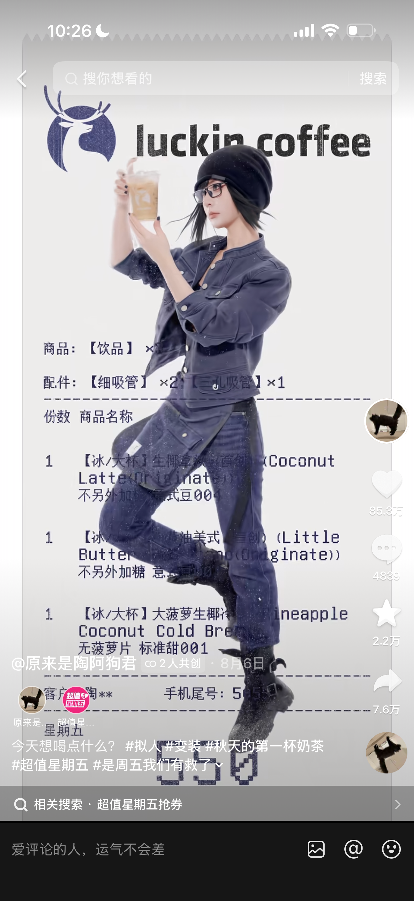

一张品牌订单小票放大当背景(商品/配件/份数/手机尾号都在),人物造型呼应该品牌配色。五张小票扇形排开 = 五个品牌五套造型(luckin coffee · 茶百道 · 蜜雪冰城 · 霸王茶姬 · 益禾堂)。抖音「超值星期五」活动。#拟人 #变装 · 85.3 万赞

## 4. Finger-driven video — 挥动手指

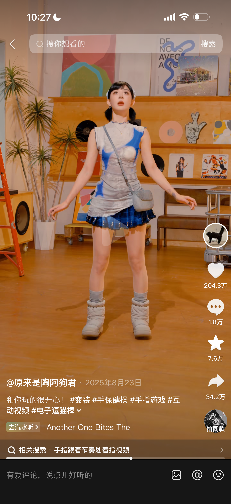

观众用手指在屏幕上划,人物跟着动。标签自称 **#电子逗猫棒**。#手指游戏 #互动视频 · 204.3 万赞

## 5. Layered polaroid, hands out of frame — 立体拍立得

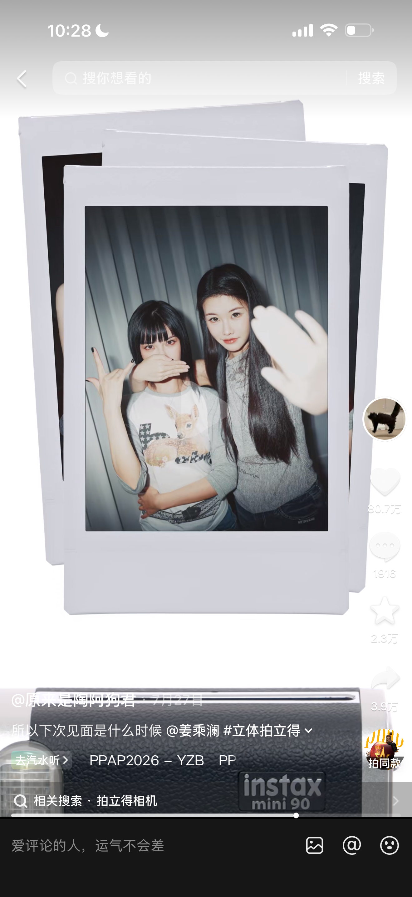
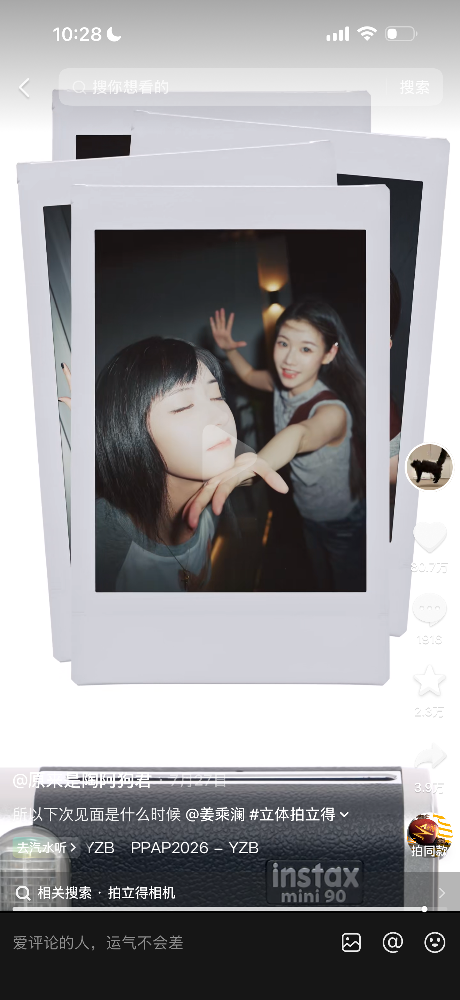

拍立得相纸叠成三层立体,人物的手**伸出相框外**打破平面。#立体拍立得 · 80.7 万赞

## 6. Outfit as a technical drawing — 穿搭三视图

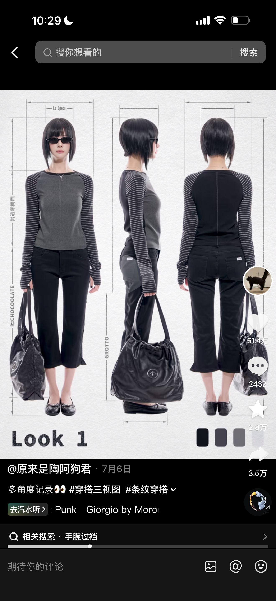
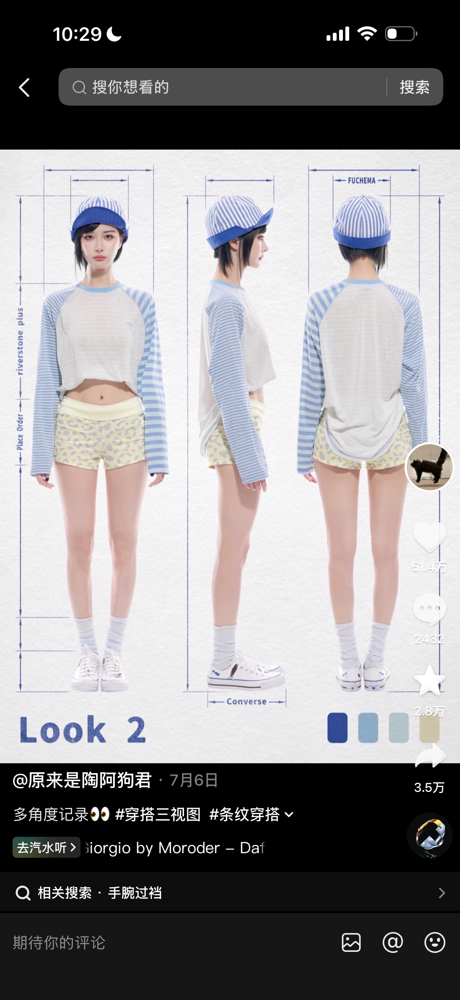

正/侧/背三视图并排,**工程制图式的尺寸标注线**,每根线标一个品牌名(Le Specs · it:CHOCOOLATE · GROTTO · Converse · FUCHEMA);右下角一排该 look 的取色。标题只有 "Look 1" / "Look 2"。#穿搭三视图 · 51.4 万赞

## 7. Tinder-style swipe to pick a makeup look — 选择心动妆容

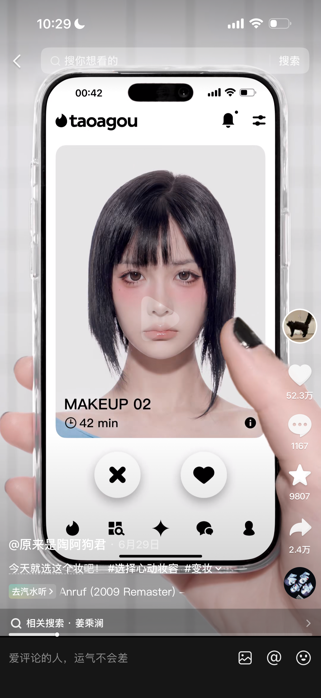

做成一个假 app「taoagou」:一张卡一个妆容,底下 ✗ 和 ♥ 两个按钮,卡上标 "MAKEUP 02 · 42 min"。约会 app 的左滑右滑用来选妆。#选择心动妆容 #变妆 · 52.3 万赞
