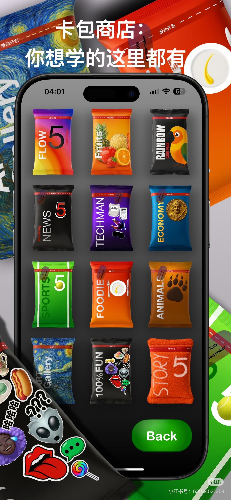
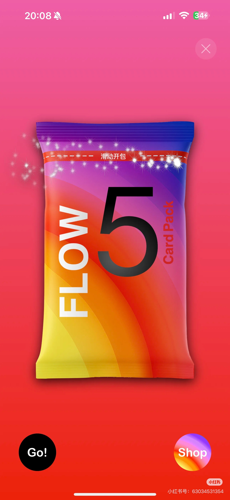
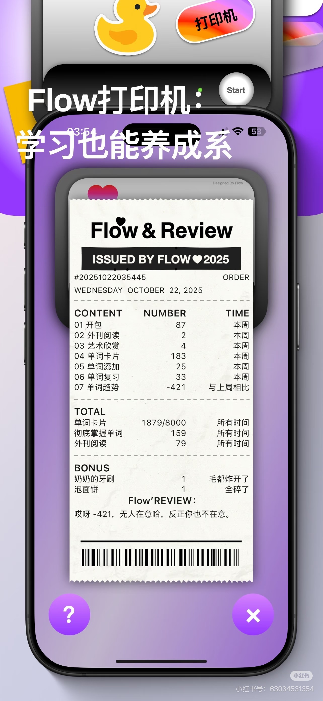

# Card packs and printed receipts as app surfaces (Flow)

**Date:** 2026-09-08 · **By:** 创始人 · **Source:** 小红书,小红书号 63033451354(app 名 Flow),截图

一个学习 app 把两样东西做成了实物:**内容分类 = 零食袋式卡包**,**周报 = 打印出来的小票**。

## 1. Content categories as snack-bag card packs — 卡包商店

十二个内容分类,每个做成一包零食/球星卡包装:FLOW 5 · Fruits · RAINBOW · NEWS · TECHMAN · ECONOMY · SPORTS · FOODIE · ANIMALS · ART Gallery · 100% FUN · STORY 5。每包顶部一条虚线撕口,写着「滑动开包」。目录变成了货架。

单包全屏时撕口带闪光动效,底部两个按钮:**Go!** 和 **Shop**。

## 2. Weekly stats printed as a receipt — Flow 打印机

周报做成一张打印小票:抬头 "Flow & Review / ISSUED BY FLOW"、订单号、日期,然后 CONTENT / NUMBER / TIME 三列列出本周开包 87、单词卡片 183、单词趋势 -421…,下面 TOTAL、BONUS(「奶奶的牙刷 1 · 毛都炸开了」),末尾一行 **Flow'REVIEW** 吐槽:「哎呀 -421,无人在意哈,反正你也不在意。」最后是条形码。上方有打印机动画和 Start 按钮。
