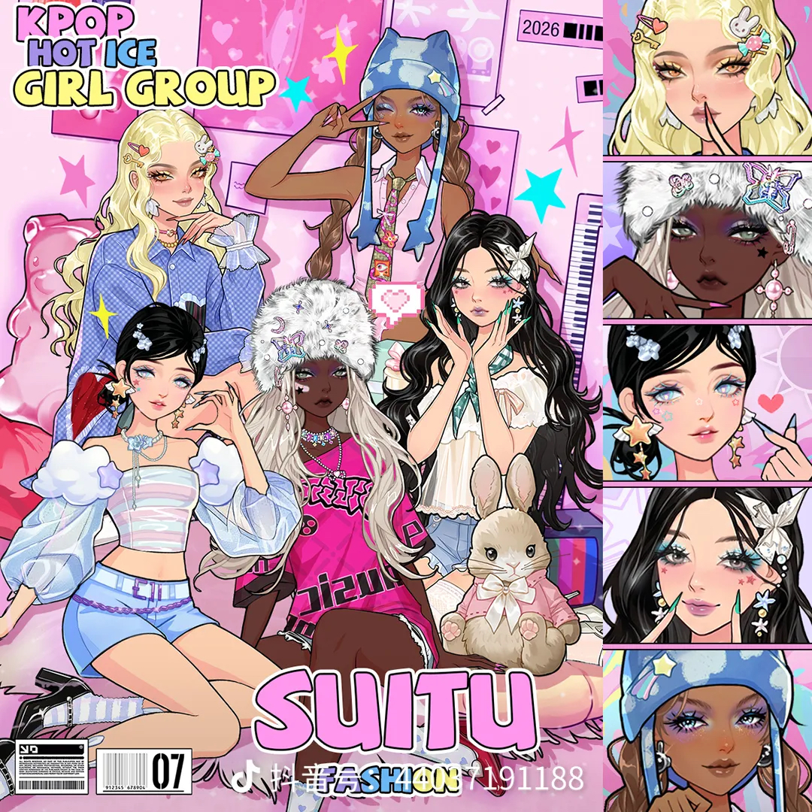
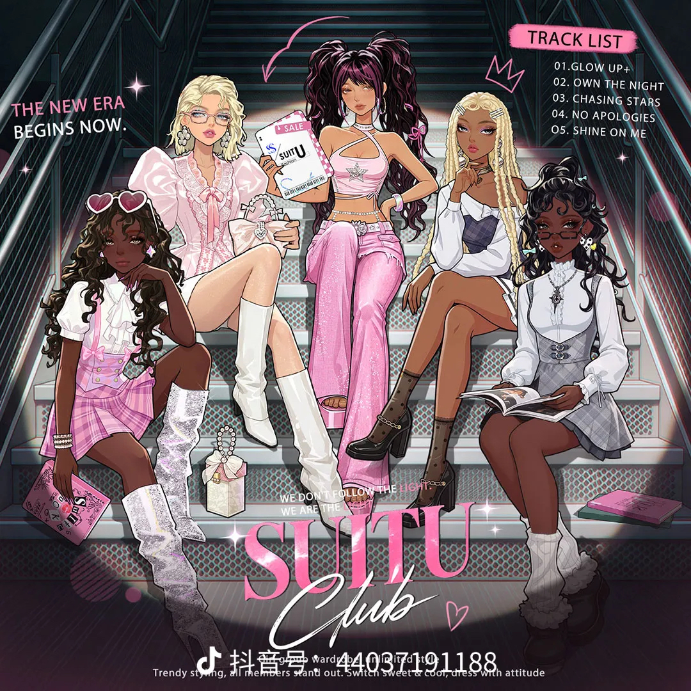
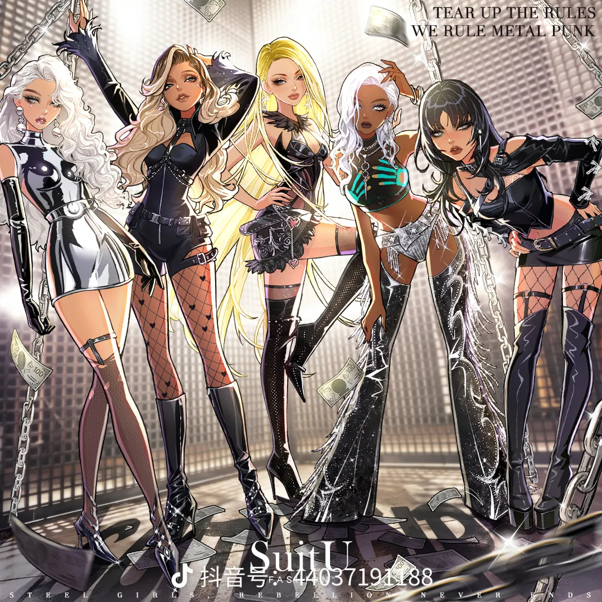
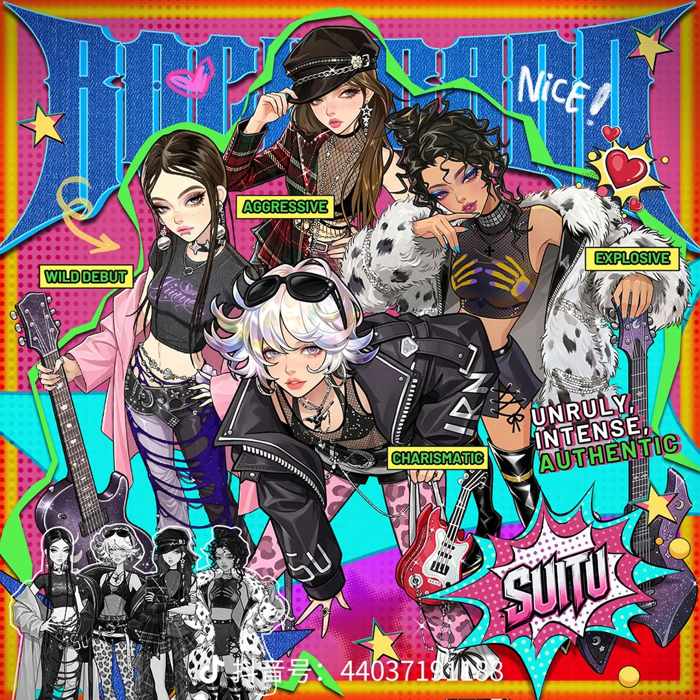

# Gen-Z cool-girl mashup — punk edge over Y2K sweetness

**Date:** 2026-09-08 · **By:** 创始人 · **Source:** 抖音 @SuitU(抖音号 44037191188),截图

中国 00 后喜欢的画风。创始人原话:

> 这是金属朋克、KPOP女团甜酷风加Y2K千禧辣妹的混搭风格,也叫**新生代酷女孩风**,把朋克的凌厉感和千禧风的少女感结合,是当下 Z 世代超火的甜酷穿搭

