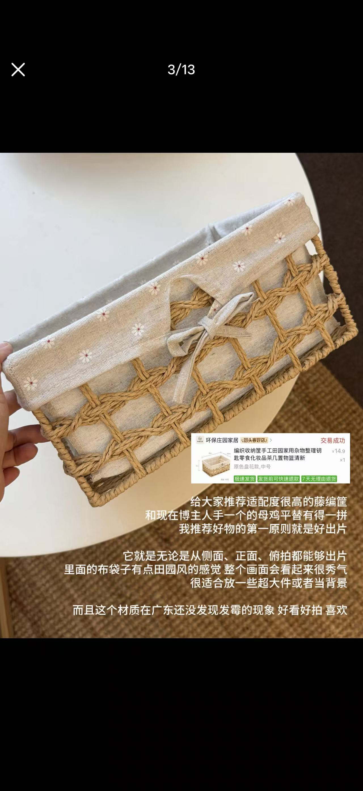
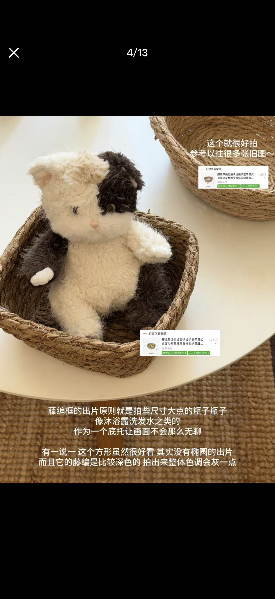
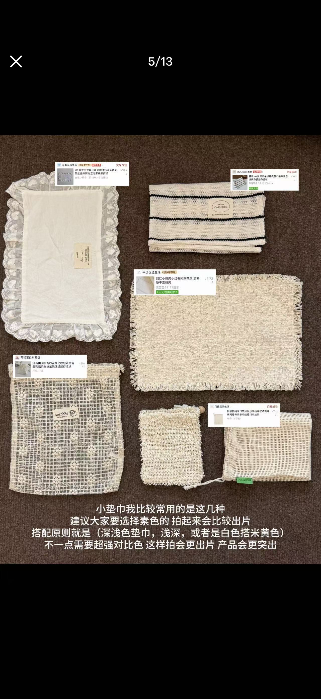
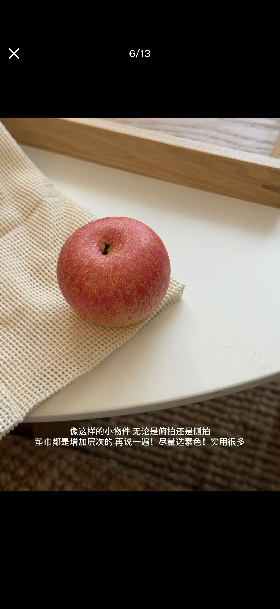
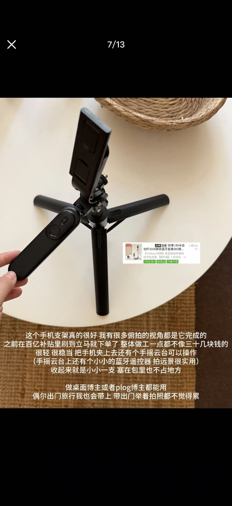
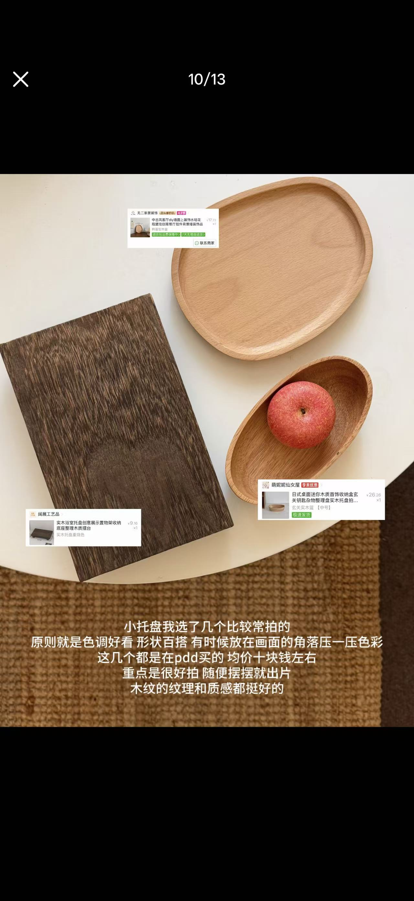

# Order-card overlay — the receipt IS the product card

**Date:** 2026-09-10 · **By:** 创始人 · **Source:** 小红书图文帖(13 图连载,此处存 3/4/5/6/7/10),截图,origin unverified

每件道具旁边直接贴一张**淘宝/拼多多订单卡片截图**——店名、缩略图、真实价格(¥7.72 / ¥9.16 / ¥14.9 / ¥26.9 / ¥36.94)、"交易成功"、以及"7天无理由退货""极速发货"这些平台徽章。不做商品图,不做链接,就把自己的订单原样贴上去:**凭证和商品卡是同一个东西**,可信度和可购买性一次给足。卡片贴在照片留白处,不遮主体。

第二条机制:整组道具的选品标准不是"好用"而是"**好出片**"——藤编筐(侧拍正拍俯拍都成立)、素色垫巾(只用深浅同色系,拒绝强对比)、木托盘(角落压色彩)、三脚架(俯拍视角来源)。等于一套「拍出小红书感」的启动套件,单价基本十块钱上下。

**Verdict:** Adopt — 订单卡片这个"证据即商品卡"的形态,比任何自建商品组件都更像用户自己会做的事。
