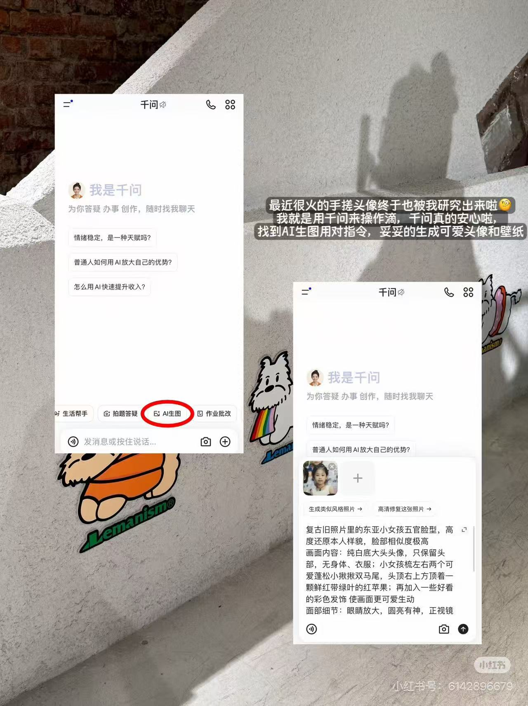

# Sticker-and-caption layer — decoration as the whole edit

**Date:** 2026-09-10 · **By:** 创始人 · **Source:** 小红书号 6142896679,截图,origin unverified

同一个博主的三条日常帖,底图是没修过的随手照(试衣间自拍、饭桌、水泥墙),全部的"设计"发生在**贴纸层**:白色手绘涂鸦(笑脸、星星)、3D emoji 贴纸(兔子耳机、刀叉爱心、拿相机的小手)、以及半透明圆角黑底的手写体文案块。文案块永远压在画面下三分之一或空白区,不居中、不对齐网格,像随手拖上去的。

第三张是教程变体:两张 App 截图**斜着浮在生活场景照上**,加投影,再用红圈圈出要点按钮。教程不做成干净的截图长图,而是让截图当贴纸用——把说明书塞回 plog 的视觉语言里。

**Verdict:** Adapt — 门槛极低的"看起来有在做内容":原图不动,只加一层。可复用为一个贴纸/文案块图层编辑器。
